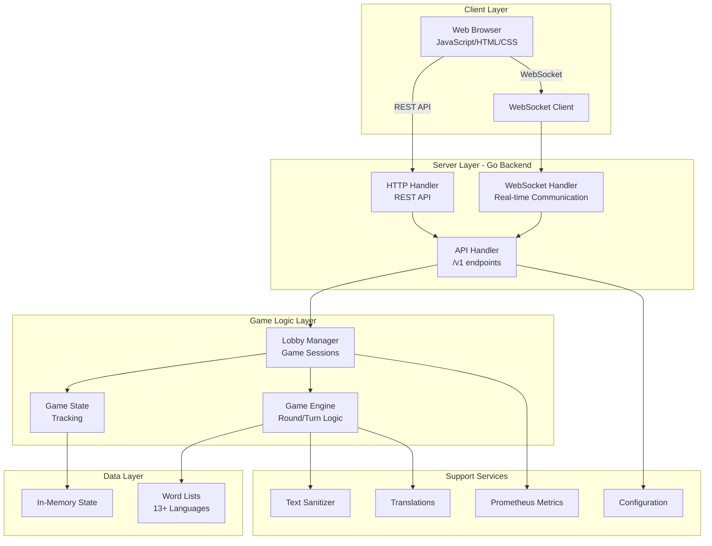
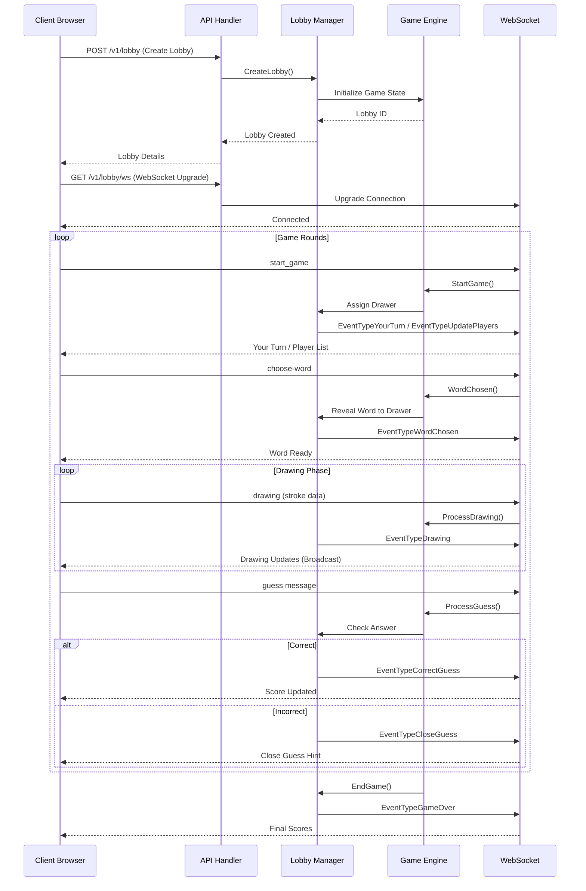

# scribble.ng - A Skribbl.io Clone

A fast, lightweight, and self-hosted alternative to Skribbl.io built with Go and modern web technologies. scribble.ng is a multiplayer drawing and guessing game where players take turns drawing while others try to guess the word.

## 🎮 Features

### Core Gameplay
- **Multiplayer Drawing Game**: Up to 24 players per lobby
- **Real-time WebSocket Communication**: Instant game state synchronization
- **Multiple Game Modes**: 
  - Chill mode (casual scoring)
  - Competitive mode (hardcore scoring)
- **Custom Word Support**: Play with your own word lists
- **Spectator Mode**: Watch games without affecting the outcome
- **Guess System**: Players guess the word being drawn with scoring/hints

### Customization
- **Configurable Settings**:
  - Drawing time (60-300 seconds)
  - Number of rounds (1-20)
  - Max players (2-24)
  - Custom words per turn (1+)
  - Language selection (13+ languages)
  - Score calculation method
  - Clients per IP limit (anti-abuse)

### Multilingual Support
- English (US & GB)
- German, French, Dutch, Italian
- Polish, Russian, Ukrainian
- Arabic, Hebrew, Persian
- Custom word lists

### Deployment & Performance
- **Self-hosted**: Full control over your game server
- **Docker Support**: Easy containerization
- **Fly.io Integration**: Zero-effort cloud deployment
- **Prometheus Metrics**: Built-in monitoring and observability
- **CPU Profiling**: Performance analysis capabilities
- **Lobby Cleanup**: Automatic inactive lobby removal
- **CORS Support**: Cross-origin requests handling

## 🏗️ Architecture

### System Architecture



### Data Flow - Game Session



## 📁 Project Structure

```mermaid
graph TD
    A["scribble.ng/"] -->|"cmd/"| B["scribblers/"]
    A -->|"internal/"| C["api/"]
    A -->|"internal/"| D["config/"]
    A -->|"internal/"| E["frontend/"]
    A -->|"internal/"| F["game/"]
    A -->|"internal/"| G["state/"]
    A -->|"internal/"| H["metrics/"]
    A -->|"internal/"| I["sanitize/"]
    A -->|"internal/"| J["translations/"]
    A -->|"tools/"| K["Development Tools"]
    
    B -->|"Entry Point"| B1["main.go"]
    
    C -->|"REST API"| C1["http.go<br/>Setup routes"]
    C -->|"API V1"| C2["v1.go<br/>Endpoints"]
    C -->|"WebSocket"| C3["ws.go<br/>Real-time"]
    C -->|"Parsing"| C4["createparse.go<br/>Request parsing"]
    
    D -->|"Configuration"| D1["config.go<br/>Env vars & defaults"]
    
    E -->|"Web UI"| E1["http.go<br/>Serve files"]
    E -->|"Templates"| E2["index.go<br/>Templating"]
    E -->|"Lobby UI"| E3["lobby.go<br/>Lobby page"]
    E -->|"Resources"| E4["js/, css/"]
    
    F -->|"Game Logic"| F1["lobby.go<br/>Game session"]
    F -->|"Data Models"| F2["data.go<br/>Structs"]
    F -->|"Game State"| F3["shared.go<br/>Constants"]
    F -->|"Words"| F4["words.go"]
    
    G -->|"State Management"| G1["lobbies.go<br/>Lobby storage"]
    
    K -->|"Word Sanitization"| K1["sanitizer/"]
    K -->|"Simulation"| K2["simulate/"]
    K -->|"Stats"| K3["statcollector/"]
    K -->|"Data Conversion"| K4["skribbliohintsconverter/"]
```



## 🛠️ Technology Stack

| Layer | Technology | Purpose |
|-------|-----------|---------|
| **Backend** | Go 1.25+ | High-performance server |
| **Web Framework** | net/http, chi-router | Routing and HTTP handling |
| **Real-time** | WebSocket (gws) | Live game communication |
| **Frontend** | HTML5, JavaScript, CSS3 | Web UI and game client |
| **Metrics** | Prometheus | Monitoring and observability |
| **Database** | In-memory (no external DB) | Game state (lobbies, players) |
| **Deployment** | Docker, Fly.io | Containerization and hosting |
| **Utilities** | UUID, petname, text/cases | ID generation, naming, text processing |

### Key Dependencies
- `github.com/lxzan/gws` - WebSocket library
- `github.com/prometheus/client_golang` - Metrics collection
- `github.com/go-chi/cors` - CORS middleware
- `github.com/Bios-Marcel/go-petname` - Random name generation
- `github.com/caarlos0/env` - Environment variable parsing
- `golang.org/x/text` - Unicode text handling

## 📋 Project Structure Details

### Core Packages

#### `cmd/scribblers/`
Entry point of the application. Initializes configuration, sets up HTTP routes, and manages the server lifecycle.

**Key Responsibilities:**
- Server startup and shutdown
- Route registration for API, WebSocket, and frontend
- CPU profiling (optional)
- Graceful shutdown handling

#### `internal/api/`
Public API endpoints for both HTTP REST and WebSocket protocols.

**Endpoints:**
```
GET    /v1/stats                          - Server statistics
GET    /v1/lobby                          - List active lobbies
POST   /v1/lobby                          - Create new lobby
GET    /v1/lobby/{lobby_id}/ws            - WebSocket connection
PATCH  /v1/lobby/{lobby_id}               - Update lobby settings
POST   /v1/lobby/{lobby_id}/player        - Add player to lobby
GET    /v1/metrics                        - Prometheus metrics
GET    /health                            - Health check
```

**WebSocket Events:**

*Incoming Events:*
- `start` - Start game
- `toggle-readiness` - Toggle player readiness
- `toggle-spectate` - Toggle spectator mode
- `choose-word` - Select word to draw
- `request-drawing` - Request drawing data
- `undo` - Undo last stroke

*Outgoing Events:*
- `update-players` - Player list update
- `word-chosen` - Word selection confirmed
- `correct-guess` - Correct answer submitted
- `drawing` - Drawing data
- `game-over` - Round/game ended
- `your-turn` - Player's turn to draw
- `update-wordhint` - Hint update
- `system-message` - Server message
- `keep-alive` - Connection keep-alive ping

#### `internal/config/`
Configuration management via environment variables with sensible defaults.


#### `internal/game/`
Core game logic and state management for drawing and guessing.

**Key Components:**
- **Lobby**: Game session container with players and settings
- **Player**: Individual player state (drawing, guessing, spectating)
- **GameEngine**: Turn management, scoring, round progression
- **WordHint**: Hint system for revealing letters progressively
- **SettingBounds**: Validation constraints for lobby customization

**Scoring Systems:**
- `chill` - Casual, balanced scoring
- `competitive` - Hardcore, skill-based scoring

**Drawing Canvas:**
- Base size: 1600x900 pixels
- Brush size: 8-32 pixels
- Stroke data broadcast to all players

#### `internal/frontend/`
Web UI serving - HTML templates, CSS, and JavaScript client.

**Assets:**
- `templates/` - Server-side HTML rendering
- `resources/` - Static CSS and JavaScript
- Embedded static files for production

**JavaScript Modules:**
- `draw.js` - Canvas drawing functionality
- `keyboardManager.js` - Keyboard input handling
- `lobby.js` - Lobby UI logic
- `index.js` - Main game client

#### `internal/state/`
Persistent in-memory state management for game lobbies.

**Responsibilities:**
- Lobby storage and retrieval
- Player connection tracking
- State cleanup and maintenance

## 🚀 Installation & Setup

### Prerequisites
- **Go 1.25.0 or higher**
- **Git**
- For Docker: Docker Engine 20.10+

### Local Development Setup

#### 1. Clone the Repository
```bash
git clone https://github.com/scribble-rs/scribble.ng.git
cd scribble.ng
```

#### 2. Download Dependencies
```bash
go mod download
go mod verify
```

#### 3. Build the Project
```bash
# Standard build
go build -o scribblers ./cmd/scribblers

```

### Configuration via Environment Variables

#### Basic Configuration
```bash
# Server settings
PORT=8080                          # Server port
NETWORK_ADDRESS=127.0.0.1         # Bind to localhost
ROOT_PATH=/                        # Root path (e.g., /scribblers)
ROOT_URL=http://localhost:8080    # Full server URL
CANONICAL_URL=http://example.com  # Original domain
ALLOW_INDEXING=false              # SEO indexing
```

#### Game Settings
```bash
# Default lobby settings
LOBBY_SETTING_DEFAULTS_PUBLIC=false
LOBBY_SETTING_DEFAULTS_DRAWING_TIME=120
LOBBY_SETTING_DEFAULTS_ROUNDS=4
LOBBY_SETTING_DEFAULTS_MAX_PLAYERS=24
LOBBY_SETTING_DEFAULTS_LANGUAGE=english
LOBBY_SETTING_DEFAULTS_SCORE_CALCULATION=chill
LOBBY_SETTING_DEFAULTS_WORDS_PER_TURN=3

# Bounds/constraints
LOBBY_SETTING_BOUNDS_MIN_DRAWING_TIME=60
LOBBY_SETTING_BOUNDS_MAX_DRAWING_TIME=300
LOBBY_SETTING_BOUNDS_MIN_ROUNDS=1
LOBBY_SETTING_BOUNDS_MAX_ROUNDS=20
LOBBY_SETTING_BOUNDS_MIN_MAX_PLAYERS=2
LOBBY_SETTING_BOUNDS_MAX_MAX_PLAYERS=24
LOBBY_SETTING_BOUNDS_MIN_CLIENTS_PER_IP_LIMIT=1
LOBBY_SETTING_BOUNDS_MAX_CLIENTS_PER_IP_LIMIT=24
```


## 🐳 Docker Deployment

### Build Docker Image
```bash
# Using linux.Dockerfile
docker build -f linux.Dockerfile \
  --build-arg VERSION="v1.0.0" \
  -t scribble.ng:latest .

# Using fly.Dockerfile (for Fly.io)
docker build -f fly.Dockerfile \
  --build-arg VERSION="v1.0.0" \
  -t scribble.ng:fly .

# Using windows.Dockerfile (Windows Nano Server)
docker build -f windows.Dockerfile \
  --build-arg VERSION="v1.0.0" \
  -t scribble.ng:windows .
```

### Run Docker Container
```bash
docker run -d \
  --name scribble-server \
  -p 8080:8080 \
  -e PORT=8080 \
  -e ROOT_URL="https://scribble.example.com" \
  -e ALLOW_INDEXING=true \
  scribble.ng:latest
```

## 🎯 Game Rules & Mechanics

### Game Flow
1. **Lobby Creation**: Players create or join a lobby
2. **Configuration**: Game settings configured before start
3. **Game Start**: Players ready themselves for the game
4. **Round Assignment**: Players are assigned as drawer each round
5. **Word Selection**: Drawer selects one of three words
6. **Drawing Phase**: Drawer draws while others guess (time-limited)
7. **Guess Phase**: Players submit guesses, receive hints/feedback
8. **Scoring**: Points awarded based on guesses and timing
9. **Round End**: Move to next round or end game

### Scoring System

**Chill Mode (Casual)**
- Guessers: Points for correct guess
- Drawer: Points for drawer bonus
- Balanced, everyone has fun

**Competitive Mode (Hardcore)**
- Guessers: Points based on speed (faster = more points)
- Drawer: Points based on correct guesses
- Rewards skill and quick thinking

### Hints System
- Progressive letter revelation
- Configurable hint count
- Strategic hint management
- Difficulty scaling

## 📝 Code Quality

### Testing Coverage
The codebase includes comprehensive test suites:
- Unit tests for game logic
- API endpoint tests
- Template rendering tests
- State management tests

### Code Organization
- Clear separation of concerns
- Modular package structure
- Well-documented public APIs
- Consistent error handling

## 🔒 Security Features

### Input Validation
- Text sanitization for user content
- XSS prevention
- SQL injection protection (N/A - no DB)

### IP-based Protection
- Configurable clients-per-IP limit
- Prevents abuse from single IP
- Customizable per deployment

### CORS Support
- Configurable allowed origins
- Credential handling
- Production-ready security headers

## 📄 License

This project is licensed under the **Apache License 2.0**. See the [LICENSE](LICENSE) file for details.

## 🤝 Contributing

Contributions are welcome! Areas for contribution:

- **Bug Fixes**: Report and fix issues
- **Features**: New game modes, mechanics
- **Languages**: Add word lists for new languages
- **UI/UX**: Improve frontend design
- **Performance**: Optimize backend/frontend
- **Testing**: Add more test coverage
- **Documentation**: Improve docs

### Development Workflow
1. Fork the repository
2. Create a feature branch: `git checkout -b feature/amazing-feature`
3. Commit changes: `git commit -m 'Add amazing feature'`
4. Push to branch: `git push origin feature/amazing-feature`
5. Open a Pull Request

### Getting Help
- **Issues**: Open an issue on GitHub
- **Discussions**: Join community discussions
- **Documentation**: Check README and inline docs

### Common Issues

**Port Already in Use**
```bash
# Change port
PORT=8081 ./scribblers
```

**CORS Errors**
```bash
# Configure allowed origins
CORS_ALLOWED_ORIGINS="http://localhost:3000" ./scribblers
```

**Lobbies Not Cleaning Up**
```bash
# Enable lobby cleanup
LOBBY_CLEANUP_INTERVAL=5m \
LOBBY_CLEANUP_PLAYER_INACTIVITY_THRESHOLD=1h \
./scribblers
```

## 🚀 Performance Optimization

### Recommended Settings for Production

```bash
# Fly.io scale to zero config
min_machines_running = 0

# Lobby cleanup
LOBBY_CLEANUP_INTERVAL=5m
LOBBY_CLEANUP_PLAYER_INACTIVITY_THRESHOLD=1h

# Game defaults
LOBBY_SETTING_DEFAULTS_DRAWING_TIME=120
LOBBY_SETTING_DEFAULTS_ROUNDS=4
LOBBY_SETTING_DEFAULTS_MAX_PLAYERS=24

# CORS
CORS_ALLOW_CREDENTIALS=true
```

## 📚 Additional Resources

- [Fly.io Documentation](https://fly.io/docs/)
- [Go Documentation](https://golang.org/doc/)
- [WebSocket RFC 6455](https://tools.ietf.org/html/rfc6455)
- [Prometheus Metrics](https://prometheus.io/docs/prometheus/latest/getting_started/)


